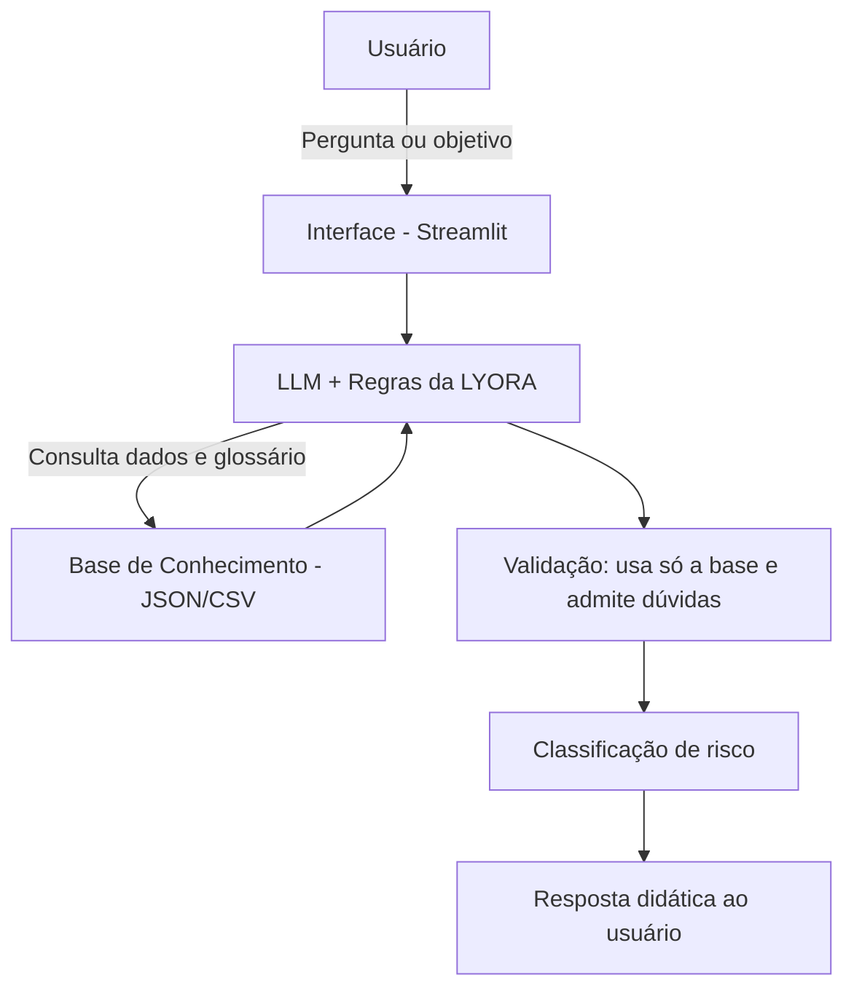

<h1 align="center">💰 LYORA — Assistente Financeira Educativa</h1>

<p align="center">
  <em>Investir com clareza e sem medo.</em>
</p>

<p align="center">
  
  
  
  
</p>

---

A **LYORA** é um assistente financeiro com IA Generativa que ensina iniciantes a investir. Ela traduz o "financês" para uma linguagem simples, explica cada termo antes de usá-lo e nunca empurra produto, sempre mostrando os prós, os contras e o nível de risco de cada aplicação.

> Projeto desenvolvido como desafio de laboratório da [DIO](https://www.dio.me/), tendo como referência o lab [Bia do Futuro](https://github.com/digitalinnovationone/dio-lab-bia-do-futuro) (Bootcamp Bradesco — GenAI & Dados).

---

## 🎯 O Problema

Muita gente quer começar a investir, mas trava logo na largada. Não entende os gráficos, se perde no vocabulário técnico do mercado (Selic, CDI, liquidez, renda fixa x variável) e, por não compreender o que está fazendo, desiste antes mesmo do primeiro passo. A barreira quase nunca é falta de dinheiro — **é falta de clareza e o medo do que não se entende**.

## 💡 A Solução — Conheça a LYORA

A LYORA resolve isso sendo, antes de tudo, **educativa**. Em vez de só responder, ela antecipa a dúvida:

- 🗣️ **Fala a sua língua** — informal no dia a dia, séria ao explicar. Todo termo técnico vem com tradução.
- 📚 **Ensina antes de sugerir** — mostra o que é, como rende e para quem serve cada aplicação.
- ⚖️ **É imparcial** — apresenta prós e contras e sempre informa o nível de risco.
- 🎯 **Respeita o seu perfil** — usa os dados reais do cliente (gastos, objetivos, tolerância a risco) para personalizar.

## 🖥️ Demonstração

<p align="center">
  
</p>

A interface traz, na lateral, o **perfil do cliente** e o **resumo do mês** (entradas, saídas e quanto sobra para investir); no centro, o **chat** com a LYORA. No exemplo, ela explica o que é o CDI de forma simples, calcula gastos por categoria a partir dos dados reais e recusa recomendações que não combinam com o perfil conservador do cliente.

## 🧠 Como Funciona (Arquitetura)



| Camada | Tecnologia |
|--------|------------|
| Interface | **Streamlit** (app web em Python) |
| IA (LLM) | **Google Gemini** (`gemini-3.6-flash`) com *fallback* para modo demo |
| Processamento de dados | **pandas** |
| Base de conhecimento | **JSON + CSV** (perfil, produtos, transações) + glossário embutido |

## 🔐 Segurança e Anti-Alucinação

A confiabilidade é o coração do projeto. A LYORA foi construída para **não inventar**:

- ✅ Responde **apenas** com base nos dados fornecidos e na base de conhecimento.
- ✅ Só recomenda produtos que existem no catálogo (`produtos_financeiros.json`).
- ✅ Quando não sabe de algo, **admite** em vez de inventar.
- ✅ Sempre informa o **nível de risco** de cada sugestão.
- ✅ Respeita o campo `aceita_risco`: se for `false`, prioriza risco baixo e não empurra renda variável.

**Limitações declaradas:** não acessa dados bancários sensíveis, não substitui um profissional certificado (CFP) e não garante retornos, todo investimento tem risco.

## 🛠️ Tecnologias

| Categoria | Ferramentas |
|-----------|-------------|
| Linguagem | Python |
| Interface | Streamlit |
| IA / LLM | Google Gemini |
| Dados | pandas, JSON, CSV |
| Diagramas | Mermaid |

## 🚀 Como Rodar

```bash
# 1. Clone o repositório
git clone https://github.com/SEU-USUARIO/lyora-assistente-financeiro.git
cd lyora-assistente-financeiro

# 2. Instale as dependências
pip install streamlit pandas google-genai python-dotenv

# 3. Rode a aplicação
streamlit run src/app.py
```

A LYORA abre direto no **modo demo** (respostas simuladas pelos dados) funciona sem configurar nada.

Para ativar as respostas completas do **Gemini**, crie um arquivo `.env` na raiz com a sua chave gratuita ([Google AI Studio](https://aistudio.google.com/apikey)):

```
GEMINI_API_KEY=sua_chave_aqui
```

## 📂 Estrutura do Repositório

```
lyora-assistente-financeiro/
├── README.md
├── .gitignore
│
├── data/                          # Base de conhecimento (dados mockados)
│   ├── perfil_investidor.json     # Perfil e metas do cliente
│   ├── produtos_financeiros.json  # Catálogo de produtos
│   ├── transacoes.csv             # Extrato de entradas e saídas
│   └── historico_atendimento.csv  # Histórico de atendimentos
│
├── docs/                          # Documentação do projeto
│   ├── 01-documentacao-agente.md  # Caso de uso, persona e arquitetura
│   ├── 02-base-conhecimento.md    # Estratégia de integração dos dados
│   ├── 03-prompts.md              # System prompt, cenários e edge cases
│   ├── 04-metricas.md             # Avaliação e testes
│   └── 05-pitch.md                # Roteiro do pitch
│
├── src/
│   └── app.py                     # Aplicação (interface + lógica + IA)
│
└── assets/
    └── lyora.png                  # Screenshot da aplicação
```

## 📚 Documentação (as 6 etapas)

| Etapa | Descrição | Documento |
|:-----:|-----------|-----------|
| 1 | Documentação do agente | [`docs/01-documentacao-agente.md`](docs/01-documentacao-agente.md) |
| 2 | Base de conhecimento | [`docs/02-base-conhecimento.md`](docs/02-base-conhecimento.md) |
| 3 | Engenharia de prompts | [`docs/03-prompts.md`](docs/03-prompts.md) |
| 4 | Aplicação funcional | [`src/app.py`](src/app.py) |
| 5 | Avaliação e métricas | [`docs/04-metricas.md`](docs/04-metricas.md) |
| 6 | Pitch | [`docs/05-pitch.md`](docs/05-pitch.md) |

## 📊 Avaliação

A LYORA foi validada com testes estruturados de **assertividade**, **segurança** e **coerência**, respondendo corretamente a consultas de gastos, admitindo quando não tem a informação, recusando temas fora de finanças e mantendo a recomendação alinhada ao perfil do cliente. Detalhes em [`docs/04-metricas.md`](docs/04-metricas.md).

## 👤 Autor

Desenvolvido por **Yago Andrade**.

[](https://github.com/yagoAndrade9)

## 🙏 Créditos

Desafio baseado no lab [dio-lab-bia-do-futuro](https://github.com/digitalinnovationone/dio-lab-bia-do-futuro) da [Digital Innovation One](https://www.dio.me/).
